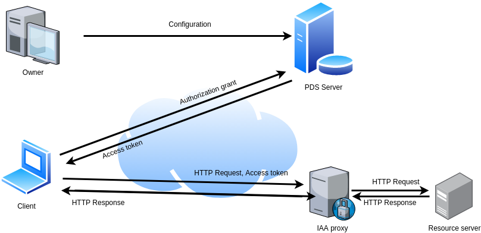

# PDS-IAA
This repository includes examples of using SOFIE's
[PDS](https://github.com/SOFIE-project/Privacy-and-Data-Sovereignty) and [IAA](https://github.com/SOFIE-project/identity-authentication-authorization) components. 

# Examples setup
Figure 1 shows the setup of our examples. PDS acts as an OAuth2.0 authorization server
that accepts as input an authorization grant, and outputs access tokens. IAA acts
as a forward proxy, it receives HTTP requests that include the access token, and if
the token is valid it forwards the request to appropriate endpoint. Additionally, we
consider (and provide) an "owner" component which is used for configuring PDS, as well
as a "resource" component which is protected by IAA. The following example vary 
depending on the type of authorization grants and of access tokens. 


Figure 1: The examples' setup

# Installation
For simplicity reasons we will use the docker images of the SOFIE's components, as well as the included configuration.

**Warning**
> The provided configuration also includes a public/private key pair used for JTW singing/verification. In a real deployment you must use
> your own keys.


## PDS
Initially clone the components repository by using:

```bash
git clone https://github.com/SOFIE-project/Privacy-and-Data-Sovereignty.git
```

Then build the PDS docker image by executing the `docker-build.sh` script


## IAA
Clone IAA repository by using

```bash
git clone https://github.com/SOFIE-project/identity-authentication-authorization.git
```

Then build the IAA docker image by executing the `docker-build.sh` script


# Example 1: Hyperldger DID authorization grant and JWT access token
This example is located in the folder `DID-jwt`.

## Prerequisites
In order to execute the example scripts you will need python3, Hyperledger Indy SDK, and SDK's python3 wrapper. You can install Indy 
SDK and the python3 wrapper by executing the following (assuming you are using Ubuntu 18.04):

```bash
sudo apt-key adv --keyserver keyserver.ubuntu.com --recv-keys CE7709D068DB5E88
sudo add-apt-repository "deb https://repo.sovrin.org/sdk/deb bionic stable"
sudo apt-get update
sudo apt-get install -y libindy
pip3 install python3-indy
```

For other operating systems follow [these instructions](https://github.com/hyperledger/indy-sdk#installing-the-sdk)

## Configuration

The example comes with a client wallet cofigured with the verification key of DID `4qk3Ab43ufPQVif4GAzLUW`, this is the same DID included
in the sample configuration of PDS. If you want to use another DID then the corresponding fields of the client script and the PDS configuration
file have to be modified. 

## Execution

Run the PDS and IAA components using the following commands:

```bash
docker run -tid --rm -p 9001:9001 pds
docker run -tid --rm -p 9000:9000 --network="host"  iaa
```

(note that `--network="host"` is used because the resource server runs in localhost, otherwise it is not needed)

Run the resource server

```bash
python3 server.py
```

Finally run the client script. The client script interacts with PDS, it receives an access token, and then 
interacts with the resource server through IAA.

```bash
python3 client.py
```

# Example 2: Accessing a resource using W3C VC as an access token
This example is located in the folder `none-W3C-VC`


## Execution

Run the IAA component using the following command:

```bash
docker run -tid --rm -p 9000:9000 --network="host"  iaa
```

(note that `--network="host"` is used because the resource server runs in localhost, otherwise it is not needed)

Run the resource server

```bash
python3 server.py
```


Finally run the client script. The client script
interacts with the resource server through IAA.

```bash
python3 client.py
```

# Example 3:PSK authorization grant and JWT access token
This example is located in the folder `auth-code-jwt`


## Execution

Run the PDS and IAA components using the following commands:

```bash
docker run -tid --rm -p 9001:9001 pds
docker run -tid --rm -p 9000:9000 --network="host"  iaa
```

(note that `--network="host"` is used because the resource server runs in localhost, otherwise it is not needed)

Run the resource server

```bash
python3 server.py
```


Finally run the client script. The client script
interacts with the resource server through IAA.

```bash
python3 client.py
```

# Example 4:PSK authorization grant and JWT/ERC721 access token
This example is located in the folder `auth-code-jwt-erc721/`

## Preparation

This example requires the compilation and deployment of some smart contracts. We will use solc compiler and ganache Ethereum emulator.
In order to install these tools execute

```bash
sudo snap install solc
npm install -g ganache-cli
```

Enter the `ganache` directory, located in the root folder of this repository, and execute the following commands

```bash
npm install sofie-pds sofie-erc721
cd node_modules
solc -o ../ --allow-paths . --abi --bin sofie-erc721/ERC721Metadata.sol
```

Then run ganache using the following command (the mnemonic is used so as the address of the deployed contract to match
the one included in the components configuarion files, otherwise the configuration files have to be modified accordingly):

```bash
ganache-cli -m myth like bonus scare over problem client lizard pioneer submit female collect
```
Finally, deploy contracts by running:

```bash
python3 deploy_contract.py
```

## Execution

Run the PDS and IAA components using the following commands:

```bash
docker run -tid --rm -p 9001:9001 --network="host" pds
docker run -tid --rm -p 9000:9000 --network="host"  iaa
```
(note that `--network="host"` in PDS is used for accessing ganache)
(note that `--network="host"` in IAA is used because the resource server runs in localhost, otherwise it is not needed)

Run the resource server

```bash
python3 server.py
```


Finally run the client script. The client script
interacts with the resource server through IAA.

```bash
python3 client.py
```


